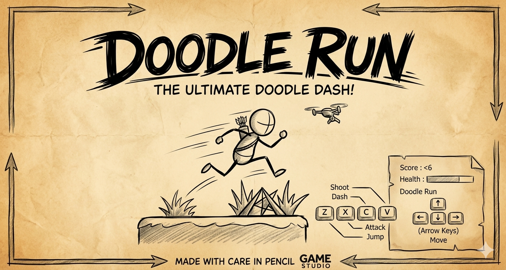

# Doodle Run

Welcome to **Doodle Run**! 

A fast-paced, action-packed endless runner built with Unity. Survive the hand-drawn hazards, rack up kills, and push your reflexes to the limit in this addictively challenging doodle world.

Play it now on itch.io: [pratikdate.itch.io/doodle-run](https://pratikdate.itch.io/doodle-run)

## 🎮 Gameplay & Objectives

Your main goal is to survive as long as possible while traversing the unpredictable terrain. The further you run and the more enemies you defeat, the higher your score climbs!

* **Distance Score**: You passively earn score the further you make it.
* **Combat Score**: Every enemy you defeat adds a massive +10 points to your overall score.
* **Final Score**: The game combines your distance and total kills when calculating your ultimate High Score on the Game Over screen.

Beware of falling off ledges into infinite pits, and keep your health bar up by dodging damage and defeating dangerous foes like the Chaser, the Flying Bird, and treacherous environmental Rocks!

## ⌨️ Controls

Master the doodle combat system with these standard controls:

* **Movement**: `Arrow Keys` (Left, Right, Down to Fast-fall/Crouch)
* **Jump**: `Up Arrow`
* **Dash**: `Z`
* **Shoot**: `X`
* **Attack (Melee)**: `C`
* **Special**: `V`

## 🛠️ Features
* Fluid procedural generation for endless levels and obstacles.
* Multi-layered enemies ranging from basic oncoming hostiles to advanced self-managed flying birds.
* Aesthetic "doodle/sketchbook" art style.
* Responsive juice-filled UI with custom dynamic damage numbers and smooth-scrolling health bars.

## 🚀 Installation / Playing Locally
If you have downloaded the local build:
1. Extract the build files to a folder on your computer.
2. Run the executable file (`Doodle Run` / `Doodle Run.exe`).
3. Have fun and try to beat your highest run!

---
*Created by Pratik Date.*
